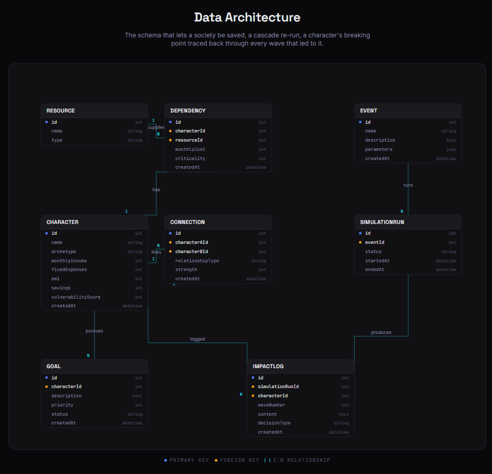

<h1 align="center">🛢️ RIPPLE</h1>

<p align="center"><em>Every event has a face.</em></p>

<p align="center"><a href="#-feature-friday--week-1"></a> <a href="#-license"></a> <a href="https://github.com/Mohitlikestocode/Ripple_Hackwave"></a></p>

<p align="center">     </p>

<p align="center"></p>

<p align="center"><i>"Petrol phir mehnga ho gaya. ₹4500 ka budget tha, ab ₹5400 lagega."</i><br/>— Ramesh, auto-rickshaw driver, Pune</p>

**RIPPLE** is a multi-agent societal-impact simulator. Build a tiny cast of
everyday characters → drop a shock event → watch the consequences cascade
through their lives, wave by wave, in their own Hinglish voices.

Not a dashboard. A narrative simulation engine. Palantir meets a Nolan film.

---

## ⭐ Feature Friday — Week 1

RIPPLE has a second route — `/feature` from the landing — that is the project's
own pitch deck rendered as one scrollable editorial page. It's the screen
demo-day judges see in 30 seconds.



| Section | What it does |
|---|---|
| **Hero** | RIPPLE wordmark over concentric pulsing rings, "Built by Team Ripple" |
| **The Invisible Chain** | The problem + a looping mini-network with a sonar pulse moving through it |
| **How it works** | Three cards — **Build** · **Drop** · **Watch** — with custom SVG glyphs |
| **Data Architecture** | A custom-SVG ER diagram of all 8 entities with blue PK / amber FK dots, mono field types, cyan `1:N` relationship lines |
| **The Experience** | Four browser-frame mocks (Builder · Event Drop · Cascade · Story Card) rendered as live SVG, not screenshots |
| **Built with** | The same pill badges you see above, but inline |

---

## 📡 60-second start

```bash
git clone https://github.com/Mohitlikestocode/Ripple_Hackwave
cd Ripple_Hackwave
npm install
npm run dev          # → http://localhost:5173
```

Works **without** an API key — falls back to a baked cascade so the demo always
plays. For the live AI version:

```bash
# create a .env file in the project root
echo "GROQ_API_KEY=your_groq_key_here" > .env
```

Get a free Groq API key at [console.groq.com](https://console.groq.com). No credit card required.

---

## 🧠 How the cascade actually works

```
event picked  →  simulateCascade()  ─┬─ has key? → POST /api/groq
                                     │            (Vite proxy attaches key
                                     │             server-side, parses JSON,
                                     │             falls back on any error)
                                     │
                                     └─ no key   → return BAKED_CASCADE
                                                   │
                                                   ▼
                                        SimulationView animates
                                        wave by wave with timed reveals
```

The chrome bar shows **· CLAUDE** or **· BAKED** so you always know which one
you're watching.

The AI model is **LLaMA 3.3 70B** served via Groq — free, fast (~200 tok/s),
and produces Hinglish diary entries indistinguishable from the Anthropic version.

---

## 🗂 The schema (8 entities, 7 relationships)

| Entity | Holds |
|---|---|
| `CHARACTER` | A person — name, archetype, income, expenses, EMI, savings, vulnerability |
| `RESOURCE` | Petrol, diesel, electricity, milk, sugar, LPG, … |
| `DEPENDENCY` | "Ramesh needs ₹4,500 of petrol at criticality 10" |
| `CONNECTION` | "Ramesh serves Priya at strength 7" |
| `GOAL` | "Save for daughter's wedding · priority 5" |
| `EVENT` | 🛢️ Petrol Price +₹20 |
| `SIMULATIONRUN` | One pass of one event over one society |
| `IMPACTLOG` | One person's experience in one wave — diary line, decision, downstream impact |

**CHARACTER** is the hub. **IMPACTLOG** is the receipt — every wave-by-wave
moment that ever happened to anyone is a row here. That's what lets
butterfly-path tracing work as a single recursive query.

---

## 🗂 File layout

```
Ripple_Hackwave/
├── src/
│   ├── App.jsx                 view router
│   ├── lib/                    cascade engine + Groq wrapper + baked fallback
│   ├── data/                   archetypes, demo society, event library
│   ├── hooks/                  useLocalStorage · useReducedMotion
│   ├── components/ui/          Button · Card · Badge · Input · Slider · GithubButton
│   ├── components/ripple/      AvatarToken · VulnerabilityBar · WaveMarker · StatReadout
│   └── screens/                Landing · SocietyBuilder · EventSelector
│                               · SimulationView · StoryPanel · FeatureFriday
├── public/
│   ├── architecture.png        the diagram above
│   └── ripple.svg              favicon
├── image.png                   the hero shot
└── vite.config.js              dev-only /api/groq proxy
```

---

## 🔑 Environment variables

| Variable | Required | Description |
|---|---|---|
| `GROQ_API_KEY` | No | Enables live AI cascades via LLaMA 3.3 70B. Falls back to baked demo if absent. |

Create a `.env` file in the project root (already git-ignored):

```
GROQ_API_KEY=gsk_...
```

---

## ✍️ A note on the writing

Character voice is **Hinglish** — Hindi grammar, English nouns when they fit,
the texture of how people actually talk. Not "translated from English."

Numbers are **JetBrains Mono**. Always. If it's data, it's mono.

**RIPPLE** is the only thing in all-caps.

---

<p align="center">
  Built by <b>Team Ripple</b> · Made for <b>Feature Friday · Week 1</b>
</p>

## 📜 License

MIT.
